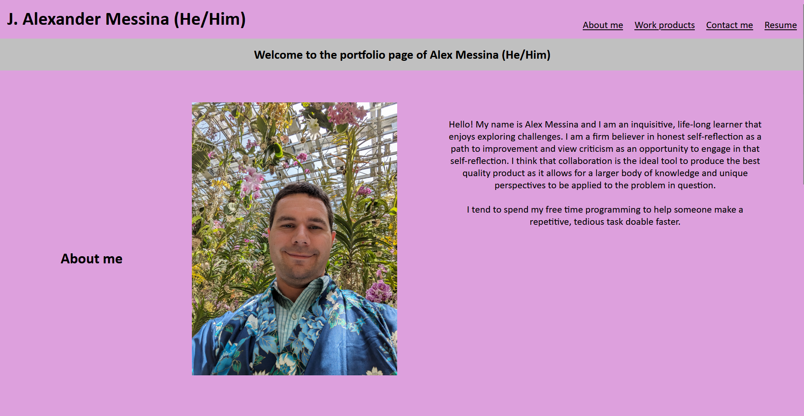
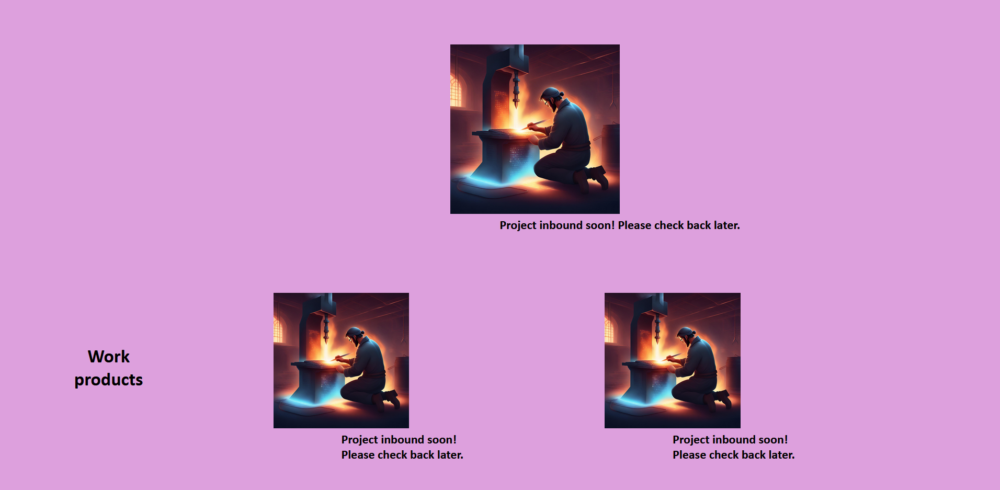
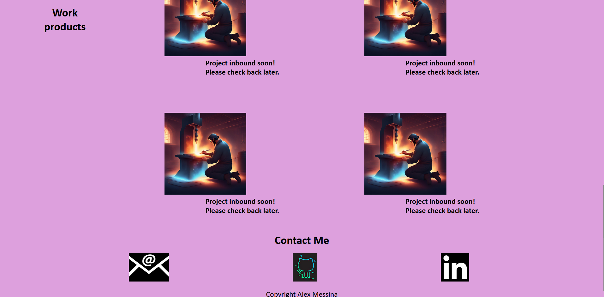
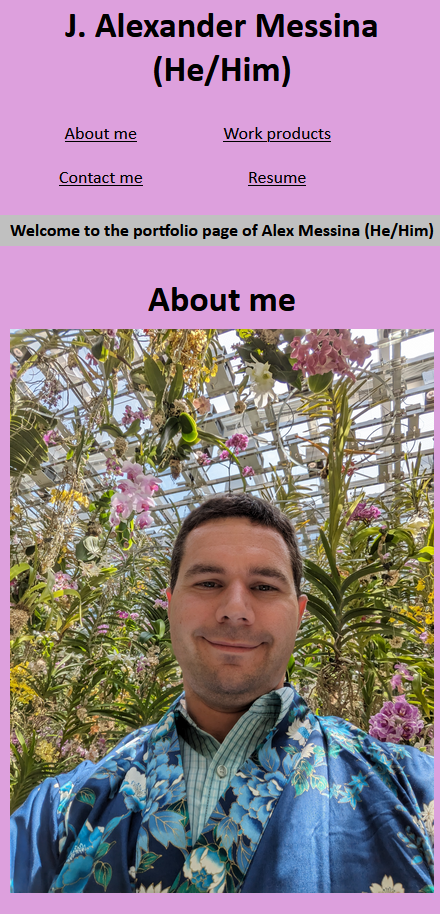
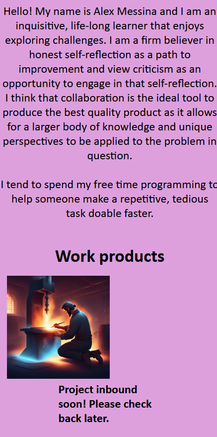
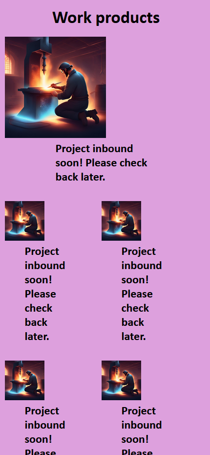
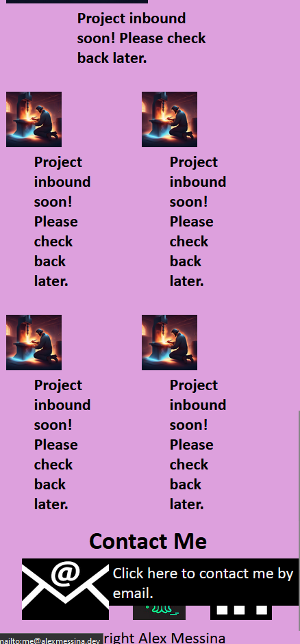

# Alex Messina Portfolio Page

## Live Project
https://executorkarthan.github.io/Alex-Messina-Portfolio/

## Description
This is a portfolio page that I devised to showcase my work and provide an easy means for people to contact me professionally. I really learned a lot about flexboxes, specifically how they can be used as a series of nested containers to obtain ideal formatting. I learned how to add hoverable tooltips and that I can use images to create icon-based links instead of using text anchors. I also used this opportunity to learn how @media to create a responsive webpage that adjusted for user screen size changes. 

## Installation and Running
N/A

## How to Use this Project
This website serves as an introduction of me to any potential employer, offering easy navigation and access to pertinent professional information. Through its navigation, potential employers can download a current resume, learn a little bit about me, look at my completed programming projects as well as contact me via email or LinkedIn. They can also see my Github repository to view projects that are less than or not graphical. 

## Credits
All the code on this website are of my own devising and I have not use any outside code contributions. The Codeforge 2.png image was created by the Canva text to image AI feature

## License
This project has an MIT license
